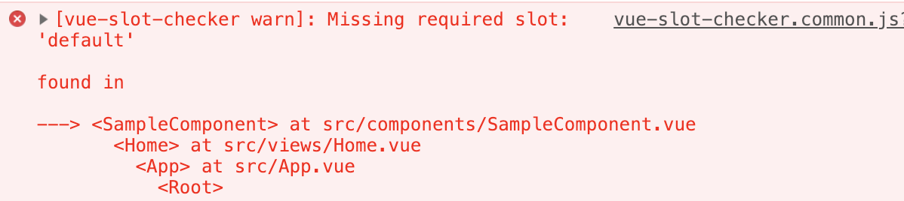

# vue-slot-checker

[](https://badge.fury.io/js/vue-slot-checker)
[](https://opensource.org/licenses/MIT)

> vue-slot-checker provide functions like checking props.

```html
<template>
  <div>
    <header><slot name="header" /></header>
    <div><slot /></div>
  </div>
</template>

<script>
export default {
  slots: ['default', 'header'], // require default slot and header slot
};
</script>
```

When using components that require default slot.

```HTML
<template>
  <div>
    <SampleComponent />
  </div>
</template>
```

It is output to the console as shown in the next image.




## Install

```bash
$ yarn add vue-slot-checker
```

[Plugin](#Plugin) or [Mixin](#Mixin).

### Plugin

Install plugin

```JavaScript
import Vue from 'vue';
import VueSlotChecker from 'vue-slot-checker';
 
Vue.use(VueSlotChecker);
```

### Mixin

Use with component

```HTML
<script>
import { vueSlotCheckerMixin } from 'vue-slot-checker';

export default {
  mixins: [vueSlotCheckerMixin],
};
</script>
```

## Usage

`slots` option

- type: `Boolean | Array | Object`

### Boolean example

Require only default slot.

```js
export default {
  slots: true,
};
```

### Array example

Require default slot and header slot.

```js
export default {
  slots: ['default', 'header'],
};
```

### Object example

Require default slot.
header slot is require and only text.

```js
export default {
  slots: {
    default: {
      required: true,
    },
    header: {
      validator(slot) {
        if (typeof slot === 'undefined') {
          return false;
        }
        return typeof slot[0].tag === 'undefined' && typeof slot[0].text === 'string';
      },
    },
  },
};
```

## Options

### `silent` (option)

- type: `Boolean`
- default: `Vue.config.silent (false)`
  - https://vuejs.org/v2/api/#silent

Don't output to log.

e.g.

```JavaScript
import Vue from 'vue';
import VueSlotChecker from 'vue-slot-checker';
 
Vue.use(VueSlotChecker, {
  silent: true,
});
```

## Example of switching in the environment

```JavaScript
import Vue from 'vue';
import VueSlotChecker from 'vue-slot-checker';

// When not used as a plugin
if (process.env.NODE_ENV === 'development') {
  Vue.use(VueSlotChecker);
}

// When using the silent option
Vue.use(VueSlotChecker, {
  silent: process.env.NODE_ENV !== 'development'
});

// When using the Vue.config.silent
Vue.config.silent = process.env.NODE_ENV !== 'development';
Vue.use(VueSlotChecker);
```

## Contribution

If you find a bug or want to contribute to the code or documentation, you can help by submitting an [issue](https://github.com/mya-ake/vue-slot-checker/issues) or a [pull request](https://github.com/mya-ake/vue-slot-checker/pulls).

## License

[MIT](https://github.com/mya-ake/vue-slot-checker/blob/master/LICENSE)
